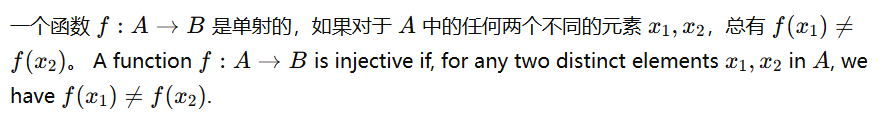
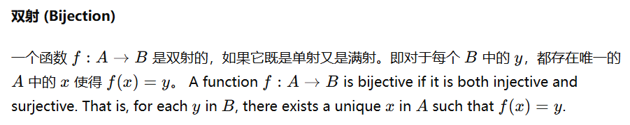
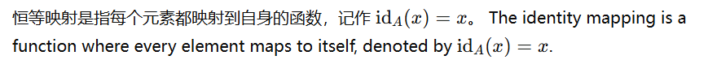
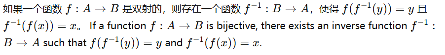
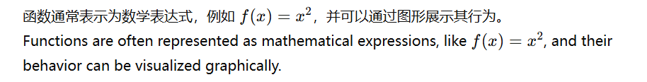
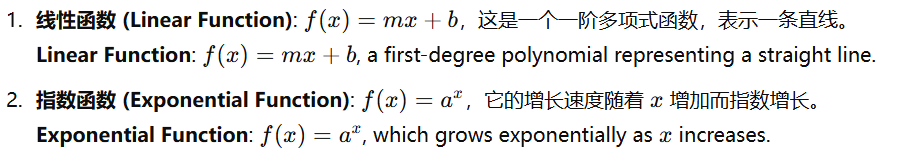

# 函数与映射 Function and Mapping

在数学中，函数 (Function) 和 映射 (Mapping) 是描述对象之间关系的重要概念。 
这两个术语常常可以互换使用，但在一些特定情境中，"映射" 更强调函数作为一个从一个集合到另一个集合的转换关系。 
以下将从定义、特性和基本概念等方面介绍函数与映射。 

### 1. 定义 Definitions

函数 (Function) 是一种规则，该规则把一个集合中的每个元素唯一地对应到另一个集合中的一个元素。
A function is a rule that assigns each element in a set to a unique element in another set.

通常，一个函数 𝑓 从集合 𝐴 到集合 𝐵 表示为 𝑓:𝐴 → 𝐵 ，其中集合 𝐴 称为定义域 (Domain)，集合 𝐵 称为值域 (Codomain)。 
The function 𝑓 from set 𝐴 to set 𝐵 is denoted as 𝑓:𝐴 → 𝐵 , where 𝐴 is called the domain, and 𝐵 is the codomain.

### 2. 映射与函数 Mapping vs. Function

在很多数学文献中，"映射 (Mapping)" 和 "函数 (Function)" 是同义词。
但在某些情况下，"映射" 强调的是一种结构或形式上的转换，尤其是涉及空间之间的关系时。
In many mathematical contexts, "mapping" and "function" are synonymous, though "mapping" can emphasize a structural or formal transformation, especially between spaces.

### 3. 基本特性 Basic Properties

#### 单射 (Injection)

<!-- 一个函数 𝑓: 𝐴 → 𝐵 是单射的， 如果对于 𝐴 中的任何两个不同的元素 x1,x2, 总有 𝑓(x1) -->
​
#### 满射 (Surjection)

#### 双射 (Bijection)

### 4. 特殊函数类型 Special Types of Functions
#### 恒等映射 (Identity Mapping)

#### 常值函数 (Constant Function)
常值函数将定义域中的所有元素映射到值域中的同一个元素。 
A constant function maps all elements of the domain to the same element in the codomain.
#### 逆函数 (Inverse Function)

### 5. 表示法与图形 Representation and Graph

### 6. 实例 Examples

