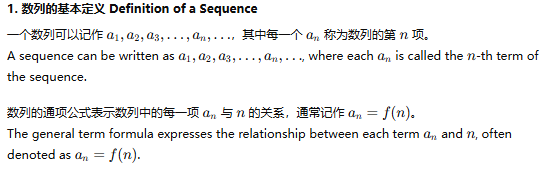
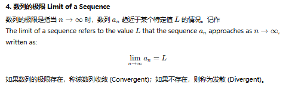

# 数列 Sequences
数列是按照一定顺序排列的一列数，通常根据某种规则或公式确定各项。
数列在数学中具有重要意义，是研究数值模式、递推关系和极限的重要工具。

A sequence is an ordered list of numbers, usually determined by a specific rule or formula. 
Sequences are significant in mathematics, helping to study numerical patterns, recurrence relations, and limits.

### 1. 数列的基本定义 Definition of a Sequence

### 2. 数列的类型 Types of Sequences

### 3. 数列的性质 Properties of Sequences
递增数列 (Increasing Sequence): 如果数列中的每一项都比前一项大，则称为递增数列。 
Increasing Sequence: A sequence is increasing if each term is greater than the previous term.

递减数列 (Decreasing Sequence): 如果数列中的每一项都比前一项小，则称为递减数列。 
Decreasing Sequence: A sequence is decreasing if each term is less than the previous term.

有界数列 (Bounded Sequence): 如果数列中的所有项都被某一特定值限制，则称为有界数列。 
Bounded Sequence: A sequence is bounded if all its terms are confined within some specific value.
### 4. 数列的极限 Limit of a Sequence

### 5. 应用 Applications
数列在数学、物理学、计算机科学等多个领域都有重要应用，例如：数值方法、微积分、经济学和人口增长模型等。
Sequences are widely used across fields such as mathematics, physics, computer science, for applications like numerical methods, calculus, economic models, and population growth modeling.
### 总结 Conclusion
数列提供了描述和研究数值变化模式的基本工具。
通过理解等差数列、等比数列、斐波那契数列等，可以帮助我们在各种科学和工程问题中找到规律和模式。

Sequences offer a foundational tool for describing and studying numerical patterns.
Understanding arithmetic sequences, geometric sequences, Fibonacci sequences, and others helps uncover regularities and patterns in various scientific and engineering problems.
